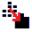

.. MosaicBuilder documentation master file, created by
   sphinx-quickstart on Sun Feb 12 17:11:03 2012.
   You can adapt this file completely to your liking, but it should at least
   contain the root `toctree` directive.

Using Mosaic Builder
============================================

.. |select_icon| image:: _static/icons/select.png
   :width: 32px
   :height: 32px

.. |selectArea_icon| image:: _static/icons/selectArea.png
   :width: 32px
   :height: 32px

.. |copy_icon| image:: _static/icons/copy.png
   :width: 32px
   :height: 32px

.. |clear_icon| image:: _static/icons/clear.png
   :width: 32px
   :height: 32px

.. |cogs_icon| image:: _static/icons/cogs.png
   :width: 32px
   :height: 32px

.. note::
   
   This plugin assumes you have permission to copy from the source layers

This plugin is designed to streamline the workflow for selecting features from one layer and copying them to another.

Instead of simply copying and pasting, users can add selected features to a temporary layer, where they can edit or merge them before copying them to the clipboard and pasting them into another layer.

Workflow Steps:

1. Select features from the active layer (or fix a specific layer using the menu). There are three selection methods:

	* Use |select_icon| to select by clicking (feature by feature)

	* Use |selectArea_icon| to select by area (box or polygon)

	* Use |disc_icon| to add a circular buffer at the clicked point 

2. You can edit the temporary vector layer using standard editing tools if you want. 

3. Use |merge_icon| to merge all the features into a single feature (note: this will remove individual feature colors)

4. Use |copy_icon| to copy the features to the clipboard using the copy tool:

5. Use |clear_icon| to remove the temporary layer when finished by clicking the delete icon:

Menu functions
============================================

We've kept settings to a minimum to make this tool as easy to use as possible. However, there are two key options you might want to adjust.

By default, the tool selects features from the currently active layer. This means you can pick a few polygons from one layer, then switch to another layer and keep selecting without changing any settings.

If you prefer to always select from a specific layer, click the |cogs_icon| in the menu.

This lets you choose a fixed source layer from your project.

You can also customise the disc tool, which adds circles with a fixed radius. Click the dropdown next to the |disc_icon| icon to adjust either:

* Radius (in map units)

* Use curves/arcs (off by default, since some datasets don't support them)

We've placed these options in the dropdown to keep things simple and easy to find.
